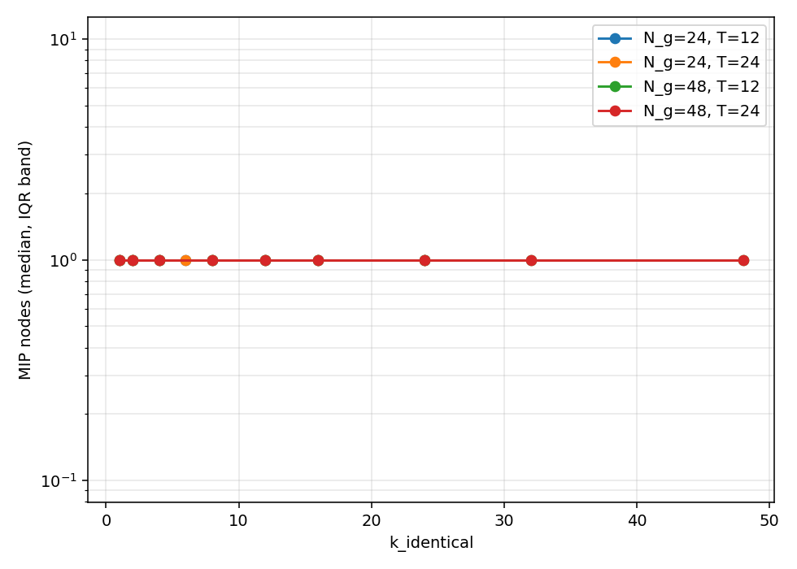
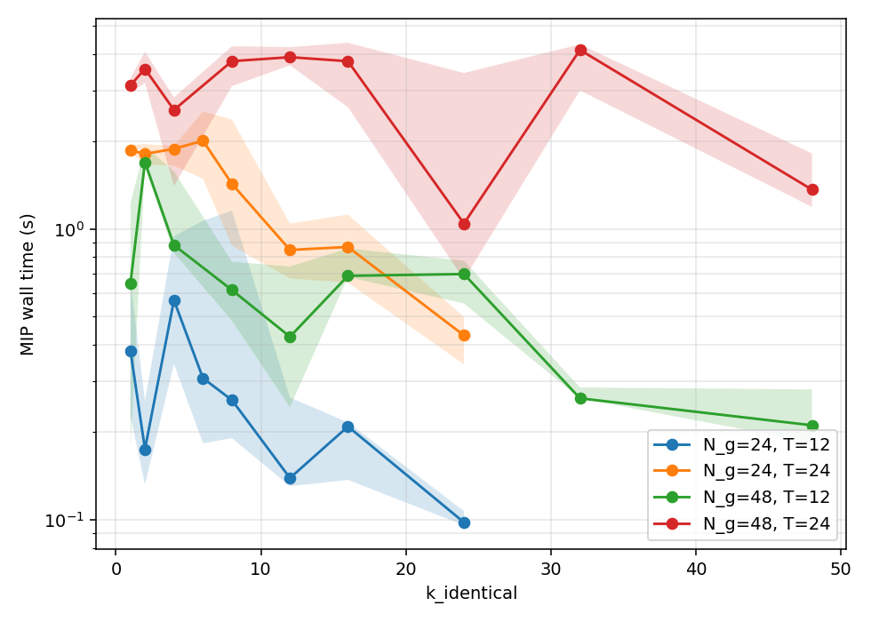
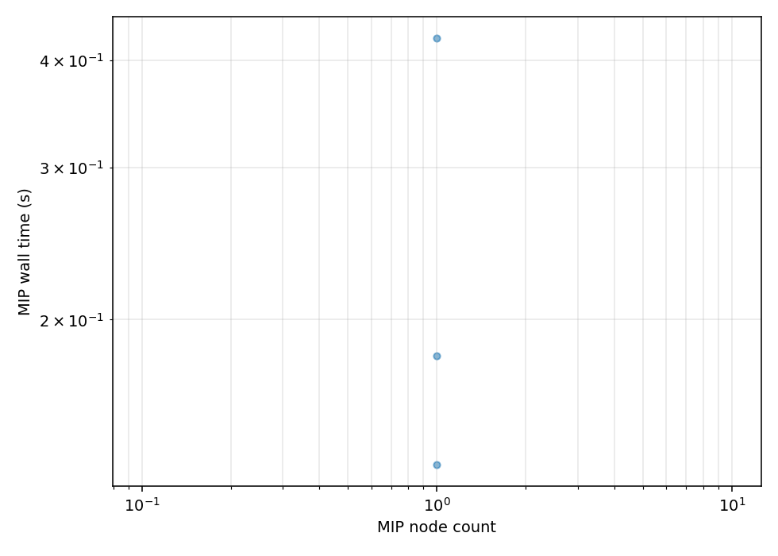
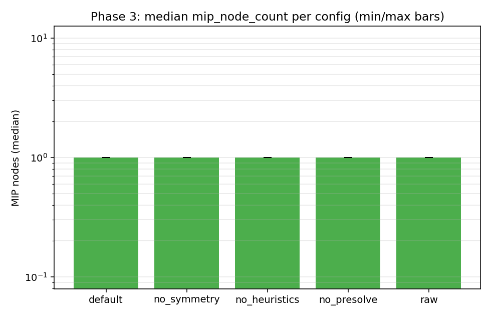
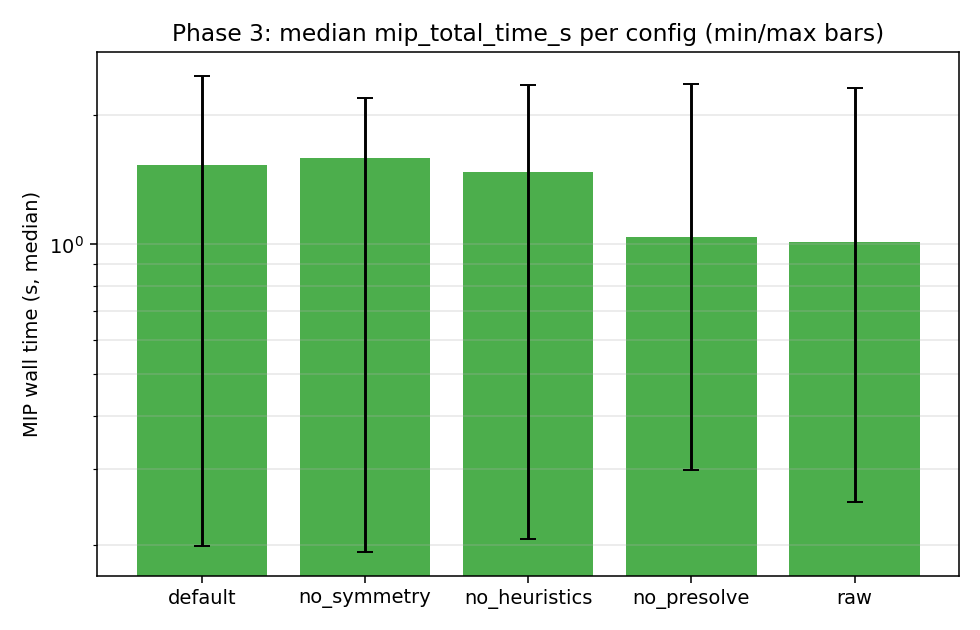
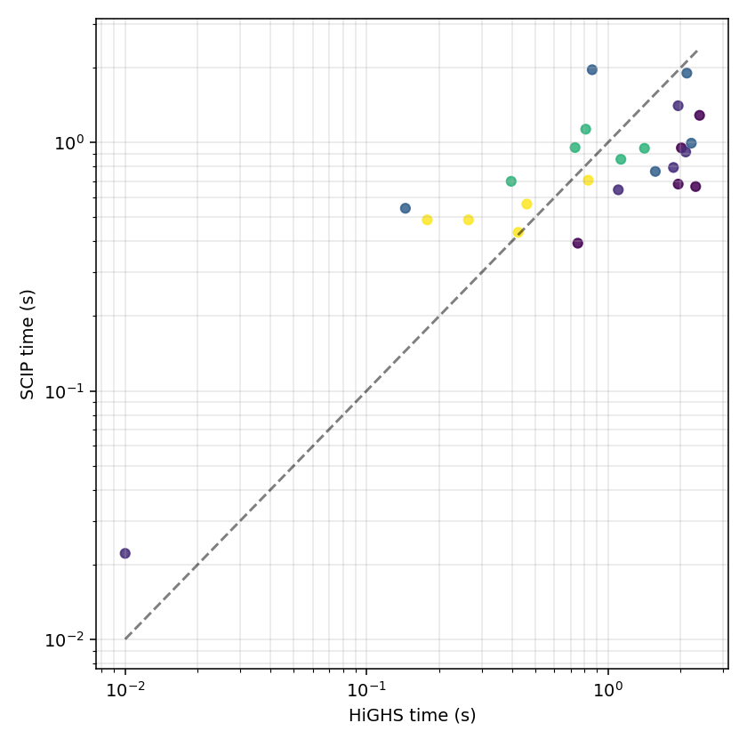
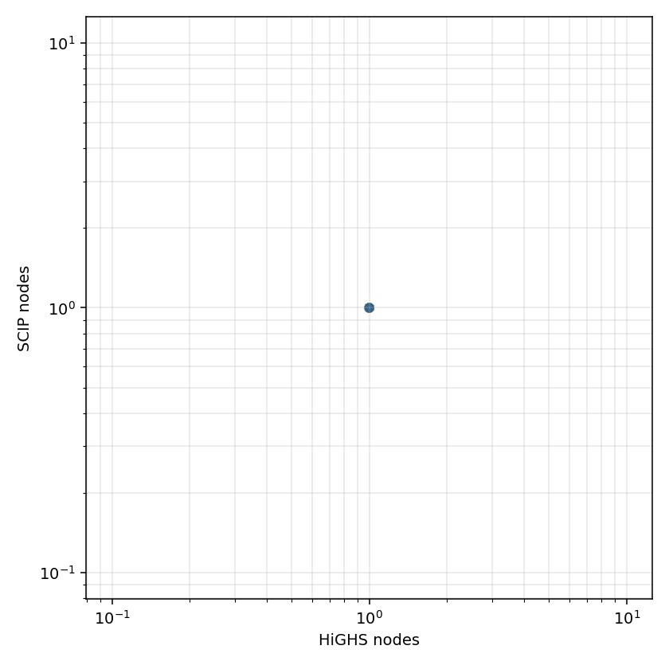

# UC Experiment v3 — Findings

*This document is a template. After running `run_v3_all.py`, fill in the numbers
and inline the figures from `plots/`. The four section headers below mirror the
four questions in the experiment plan.*

---

## 1. How does N_nodes scale with the symmetry parameter k?

**Setup.** N_g ∈ {24, 48}; k_identical ∈ {1, 2, 4, 6, 8, 12, 16, 24} (and the
analogous grid for N_g=48); T ∈ {12, 24}; 5 seeds; three_bin formulation;
HiGHS default settings; 300 s time limit.

**Result.** *(fill in: monotonicity, dynamic range across k, where the curve
crosses 10/100/1000 nodes; quoted power-law exponent for time vs nodes;
compare to v2's 1.25)*

---

## 2. Does `detect_symmetry` help, and how much, and on which instances?

**Setup.** Top-decile-hardest Phase 1 instances re-solved twice (off / on).
Same seed, same time limit. Paired scatter on log-log.

**Result.** *(fill in: median ratio (off/on) on the full set and on the high-
symmetry tail; whether the 2x acceptance criterion is met)*

---

## 3. Which solver feature is doing the most work in v1's "everything solves at root"?

**Setup.** One mid-range instance (N_g=24, k=8, T=24), 5 seeds, 600 s limit.
Five configs: default, no_presolve, no_heuristics, no_symmetry, raw.

**Result.** *(fill in: ordering of configs by node count and time; which
feature is dominant; whether the 10x acceptance criterion is met)*

---

## 4. Is the v2 story HiGHS-specific or does SCIP show the same pattern?

**Setup.** Subset of Phase 1 (N_g=24, T=24, k ∈ {1,4,8,16,24}, seeds 42-46).
HiGHS default vs SCIP default.

**Result.** *(fill in: median ratios by k; whether both solvers see the
symmetry effect; any solver-specific surprises. If pyscipopt was not
installed at run time, document the HiGHS-only fallback here.)*

---

## 5. (Bonus) Does the v3 story hold on real PGLib-UC instances?

**Setup.** PGLib-UC small + medium instances from `ca/`, `ferc/`, `rts_gmlc/`
(thermals only, horizon truncated to 24 h). HiGHS + SCIP defaults, 600 s.

**Caveats.** Our adapter lossily linearizes piecewise costs, picks the hot-
start cost from PGLib's lag-dependent startup table, ignores `must_run`, and
does not net out renewables by default. Objective values therefore do not
match PGLib reference values. The branching behaviour and presolve effects
*are* a fair comparison, which is the point of v3.

**Result.** *(fill in: do real instances solve at root like v1 synthetic UC?
Where does HiGHS vs SCIP land on real cases? Is the picture different from
the symmetric-synthetic story?)*
