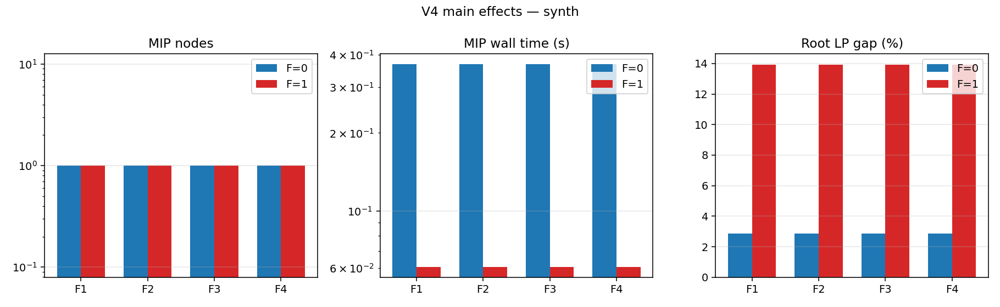
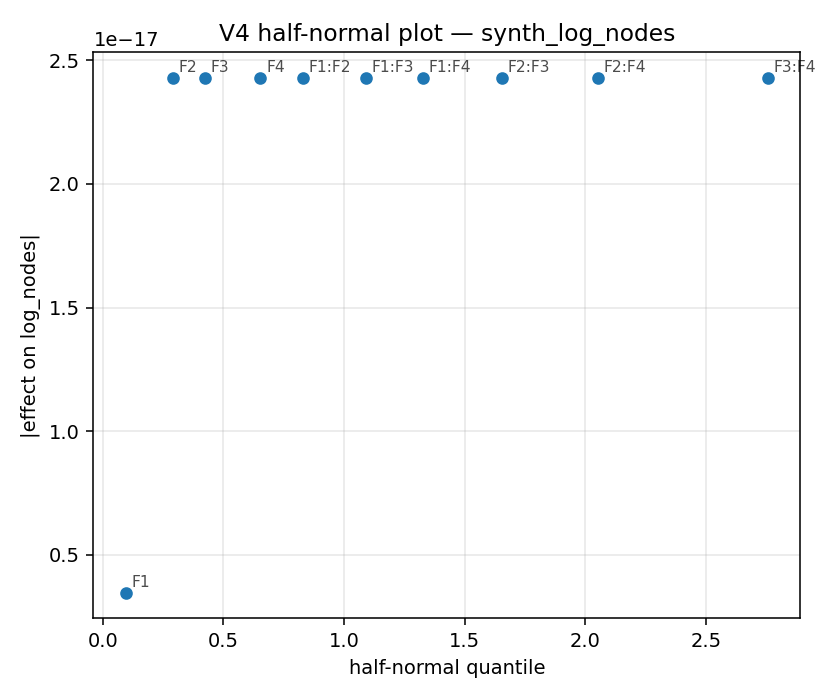

# UC Experiment V4 — Findings

*Template. Fill in after running `run_v4_all.py` and inspecting `analyze_v4.py` output.*

V3 used a stripped-down `three_bin` UC formulation. V4 reintroduces four
features one at a time (full 2^4 factorial) on both synthetic and PGLib
instances to measure which (if any) materially changes branching behaviour
under HiGHS defaults.

---

## F1 — Piecewise quadratic cost

Replace the v3 single-segment linear cost with 4 PWL segments.

**Result.** *(fill in: F1 coefficient in the log-nodes regression; whether
the truer cost fit makes the LP relaxation tighter or looser; effect on
wall time)*

---

## F2 — Separate startup/shutdown ramp limits

Tight `P[i,t] ≤ P_max·u - (P_max-SU)·v - (P_max-SD)·w[t+1]` constraint
(Knueven §3.3) replaces the simple `P ≤ P_max·u`.

**Result.** *(fill in: F2 coefficient; how often the constraint binds;
interaction with F1 if any)*

---

## F3 — Lag-dependent startup costs

Three startup categories (hot/warm/cold) via arc binaries `δ[i,t,s]`.

**Result.** *(fill in: F3 coefficient; node-count impact of the extra
binaries; whether brackets actually differentiate decisions)*

---

## F4 — Must-run enforcement

Force `u[i,t] = 1` for must-run units. On synthetic instances 20% of
diverse-block units (smallest pmin) are marked. On PGLib, the flag comes
from the JSON (rare).

**Result.** *(fill in: F4 coefficient; whether forcing commitment changes
optimal dispatch enough to alter branching)*

---

## Interactions

OLS regression `log10(nodes+1) ~ F1+F2+F3+F4 + 2-way interactions` reveals
whether any feature pair has a super-additive effect on branching.

**Result.** *(fill in: largest interaction term; whether the half-normal
plot picks out non-trivial effects above the noise floor)*

---

## Acceptance criterion

> At least one of F1–F4 changes median log10(nodes) by ≥ 0.5 (3× swing) on
> at least one instance set.

*(fill in: pass/fail)*
