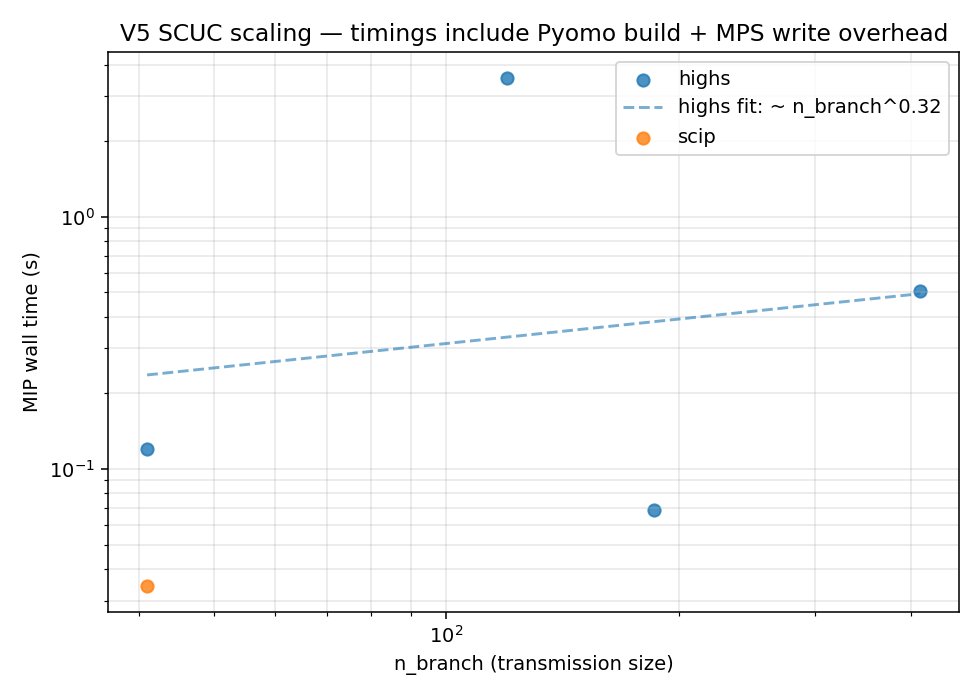
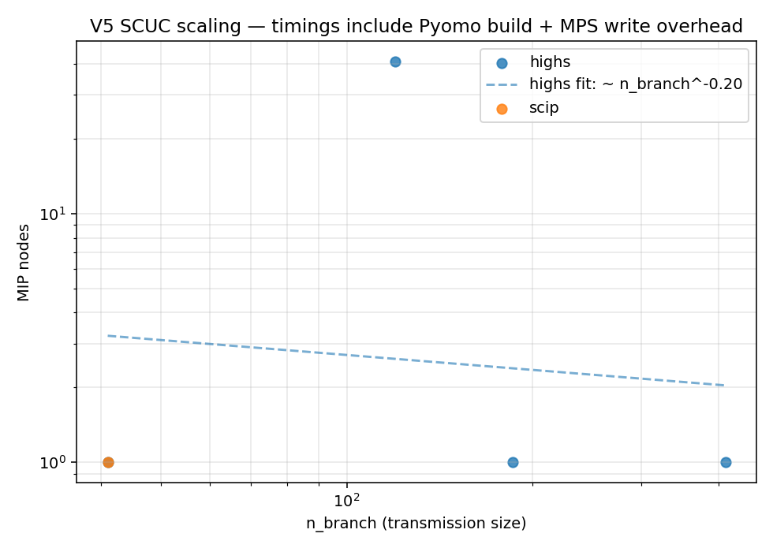
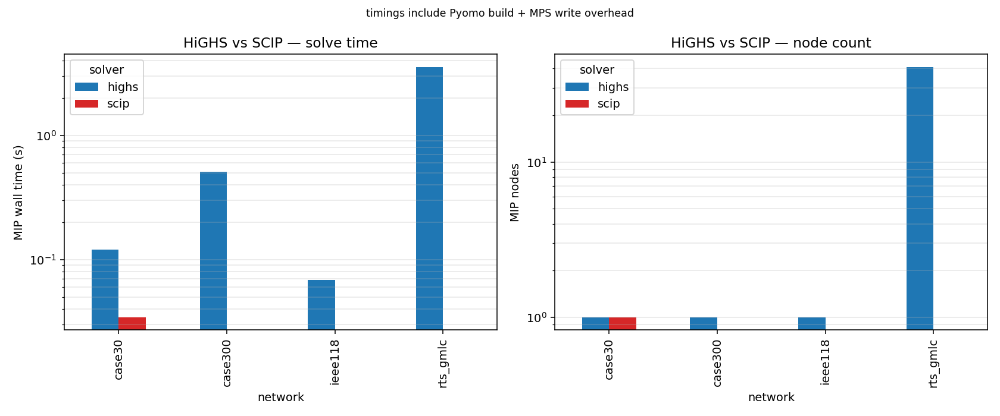

# UC Experiment V5 — Findings

*Template. Fill in after running `run_v5_all.py` and reading `analyze_v5.py`.*

V3 and V4 ran on single-bus (copperplate) UC, where the LP relaxation is
nearly the whole problem and HiGHS solves almost everything at the root.
V5 introduces DC power flow with PTDF transmission limits to see whether
real-grid network coupling restores meaningful branching pressure and how
solve cost scales with network size.

---

## Scaling: nodes and time vs network size

**Result.** *(fill in: power-law exponents on time and nodes; whether
RTS-GMLC and the synth-UC MATPOWER cases fall on the same curve, or
whether the synthesised UC parameters meaningfully change scaling)*

---

## HiGHS vs SCIP

**Result.** *(fill in: which solver wins at each network size; whether
the gap widens with size; any solver-specific timeouts)*

---

## How V5 compares to V3 (same data, no transmission)

The RTS-GMLC generators are also the basis of PGLib-UC's `rts_gmlc/` cases.
V3 ran those single-bus and saw most cases solve in <1 s at the root node.
V5 runs the same generators on the RTS-GMLC *network*.

| metric | V3 (PGLib `rts_gmlc/`) | V5 (RTS-GMLC + transmission) |
|---|---|---|
| median nodes | *(fill in from v3 analysis)* | *(fill in from v5)* |
| median time  | *(fill in)* | *(fill in)* |

**Result.** *(fill in: factor by which transmission slows the same
underlying problem)*

---

## Caveats

- **Synthesised UC parameters.** case30, IEEE-118, case300 are MATPOWER
  OPF cases; we made up min_up, min_dn, ramps, startup costs from a
  heuristic. Their objective values aren't comparable to any reference;
  use them for scaling only.
- **Pyomo overhead.** All timings include the Pyomo build + MPS write
  step. For small networks this overhead can dominate.
